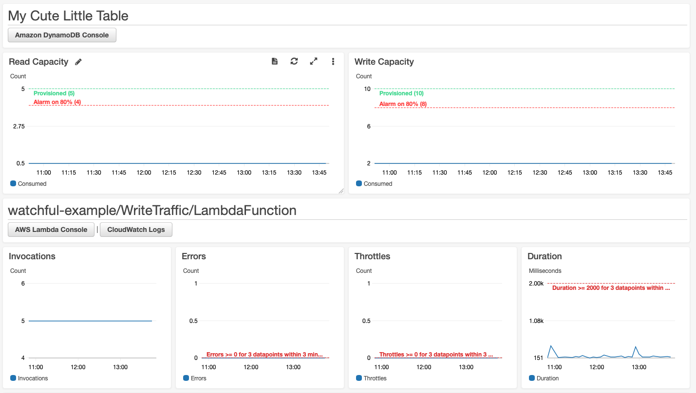

# cdk-watchful

[](https://circleci.com/gh/eladb/cdk-watchful)
[](https://pypi.org/project/cdk-watchful/)
[](https://www.npmjs.com/package/cdk-watchful)

> Watching your CDK back since 2019

Watchful is an [AWS CDK](https://github.com/awslabs/aws-cdk) construct library that makes it easy
to monitor CDK apps.

Watchful can manage a nice central dashboard and automatically configure default alarming for the following AWS resources:

- Amazon DynamoDB
- AWS Lambda
- [Request yours](https://github.com/eladb/cdk-watchful/issues/new)

## Install

TypeScript/JavaScript:

```console
$ npm install cdk-watchful
```

Python:

```console
$ pip install cdk-watchful
```

## Initialize

To get started, just define a `Watchful` construct in your CDK app (code is in
TypeScript, but python will work too):

TypeScript/JavaScript:

```ts
import Watchful from 'cdk-watchful';

const wf = new Watchful(this, 'watchful', {
  alarmEmail: 'your@email.com'
});
```

Python:

```python
from cdk_watchful import Watchful

wf = Watchful(self, 'watchful', alarm_email='your@amil.com')
```

## Add Resources

TypeScript/JavaScript:

```ts
wf.watchDynamoTable('My Happy Little Table', littleTable);
wf.watchDynamoTable('My Very Happy Table', veryHappyTable);
wf.watchLambdaFunction('The Function', fn);
```

Python:

```python
wf.watch_dynamo_table('My Happy Little Table', table)
wf.watch_lambda_function('Handler1', handler1)
wf.watch_lambda_function('Handler2', handler2)
```

## Watching Scopes

Watchful can also watch complete CDK construct scopes. It will automatically
discover all watchable resources within that scope (recursively), add them
to your dashboard and configure alarms for them.

TypeScript/JavaScript:

```ts
wf.watchScope(storageLayer);
```

Python:

```python
wf.watch_scope(storage_layer)
```

## Example

See a more complete [example](./example/index.ts), which will result in
the following dashboard and alarms:



## License

[Apache 2.0](./LICENSE)
